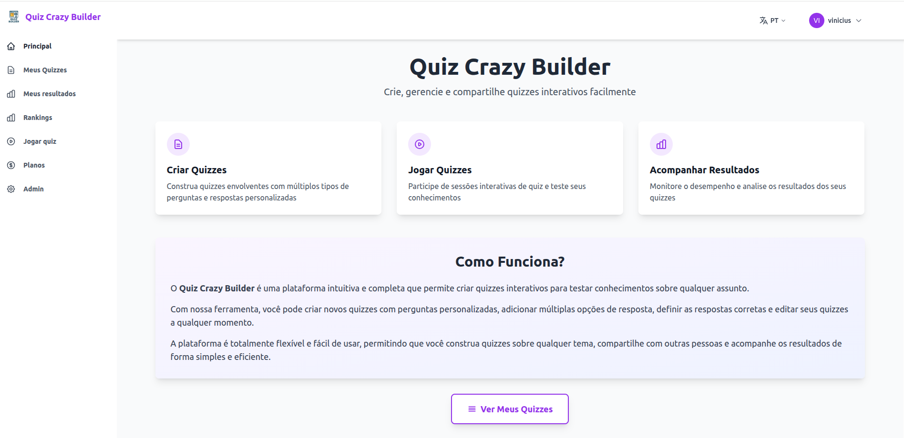

<!-- HEADER -->

## Olá,  eu sou o Vinicius

<!-- Descrição sobre mim -->

👨‍💻 Desenvolvedor de software, apaixonado por resolver problemas com código 
👨‍🎓 Graduado em ciência da computação pela Universidade Federal de São João Del Rei - UFSJ 
🚀 Sempre aprendendo e explorando novas tecnologias e ferramentas 

  

<!-- ### 📊 GitHub Stats -->

### 🚧 Projetos em destaque

#### 🧠 QuizCrazyBuilder (Privado)
Plataforma SaaS para criação e gerenciamento de quizzes.

  

## 🌐 Experimente a plataforma

🔒 Código-fonte privado • Demonstração pública disponível

 

<!-- Badges -->

	
---

<!--
### 🚧 Projetos em destaque

- 💉 [Sistema de Gestão de Vacinação](https://github.com/viniciusTurn/projeto-vacinacao)
- 🧾 [API para integração com sistema de saúde](https://github.com/viniciusTurn/api-integracao)

### 🧠 QuizCrazyBuilder (Privado)
Plataforma SaaS para criação e gerenciamento de quizzes.

**Tecnologias**
- Laravel
- PHP
- Bootstrap
- SQLite / MySQL
- Brevo

🔗 Demonstração: https://quizcrazybuilder.com.br

> Código-fonte privado.

-->

<!-- FOOTER -->

